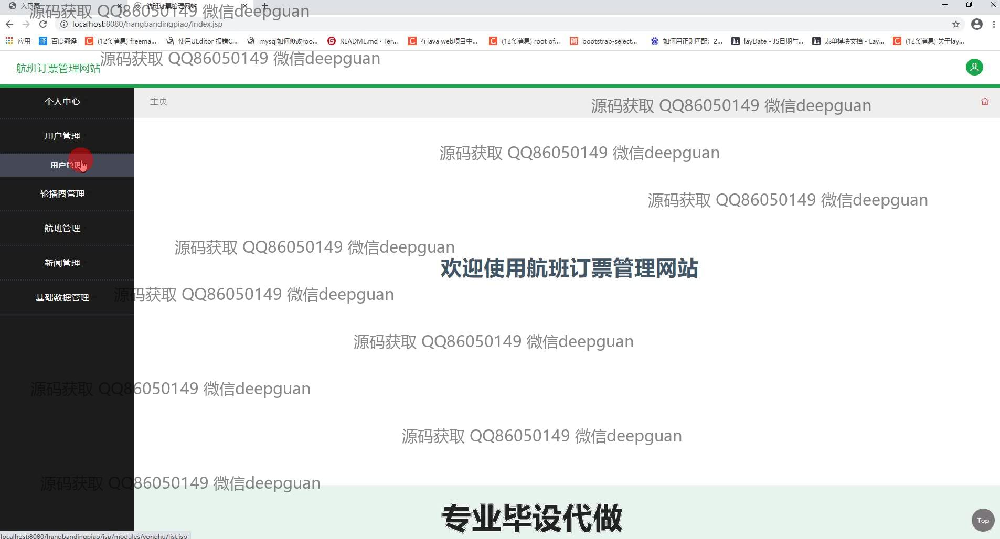
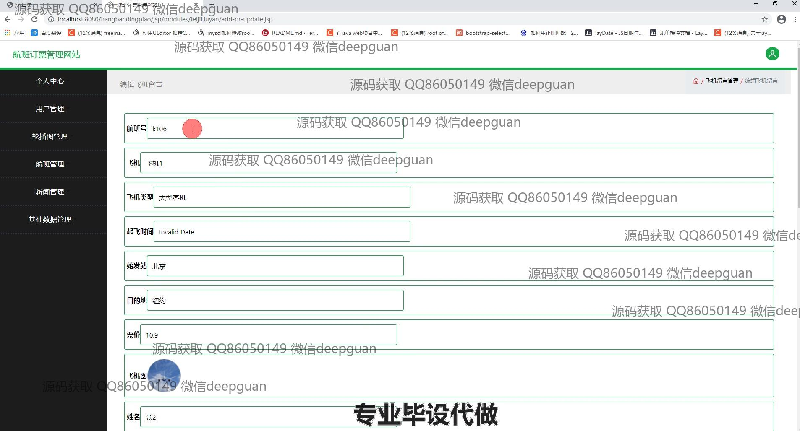
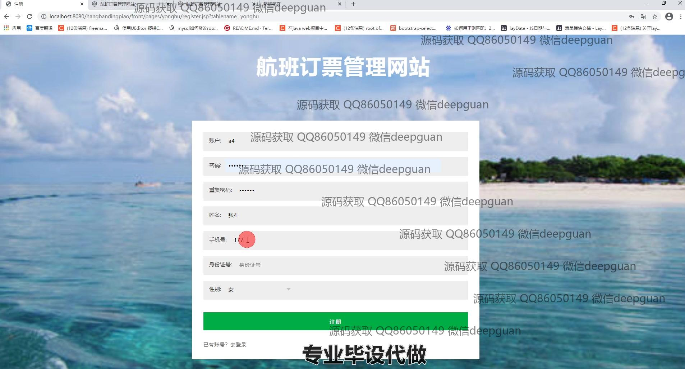
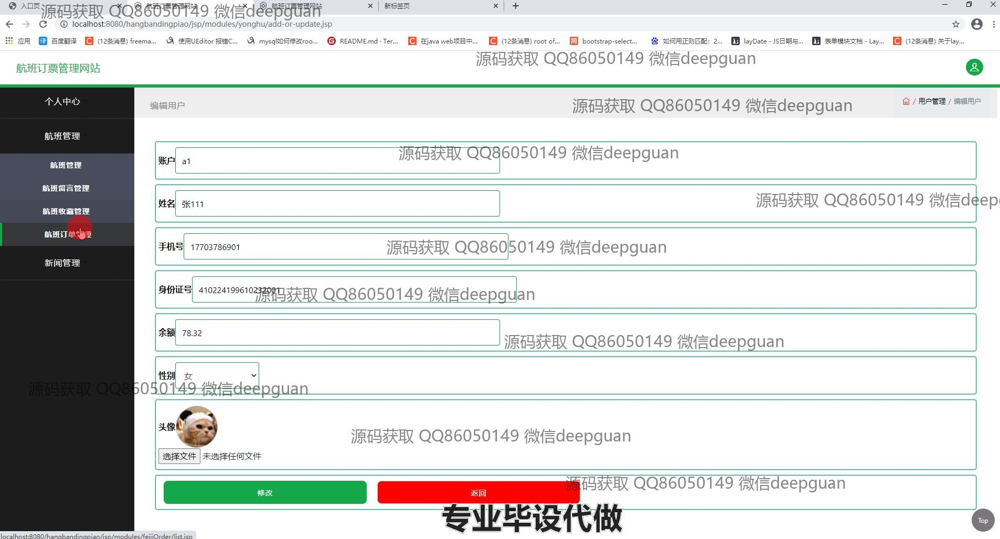

<h1 align="center">航班订票管理系统</h1>

## 简介
航班订票管理系统：角色分为管理员、用户；提供用户管理、航班管理、轮播图管理、新闻管理、订单管理及个人中心等功能模块，支持高效的航班查询与预订。    --计算机毕业设计源码；毕设源码；java毕业设计源码

## 联系方式

<h3 align="center">获取完整代码与数据库文件 + 微信：deepguan QQ: 86050149 QQ群: 783742310</h3>

<h3 align="center">可帮忙远程部署 包运行成功！提供远程部署、修改代码、设计文档指导、代码讲解等服务！</h3>

## 功能介绍（完整见运行截图）
管理员：基本功能包括登录、注册、退出系统等操作。可通过主导航栏访问用户管理、航班管理、新闻管理、轮播图管理及基础数据管理模块。管理员能够新增、修改、删除用户和航班信息，管理新闻类型和内容，上传并维护轮播图，设置基础数据，优化系统内容。个人中心支持查看和编辑个人信息，管理账户及安全设置。

用户：主要功能包括登录、注册、退出账号，并通过导航栏访问航班展示、新闻资讯、个人中心等模块。在航班管理中，用户可以根据航班号、类型、价格范围、始发站和目的地进行搜索，查看详细航班信息并完成订票。个人中心支持管理个人信息、查看订单、收藏航班以及更新账户数据。

游客：可以访问网站首页，查看航班展示、新闻内容、自然风光等公共信息。通过注册功能创建个人账户以解锁更多功能。首页轮播图展示航班和推荐内容，游客可通过宣传标语了解系统的特点和便捷性。

系统操作员：负责管理网站的日常维护工作，包括航班数据的更新、新闻和图片内容的审核及上传，优化用户界面及体验，确保系统稳定运行。

## 运行截图

本代码来源于网络,仅供学习参考使用!

